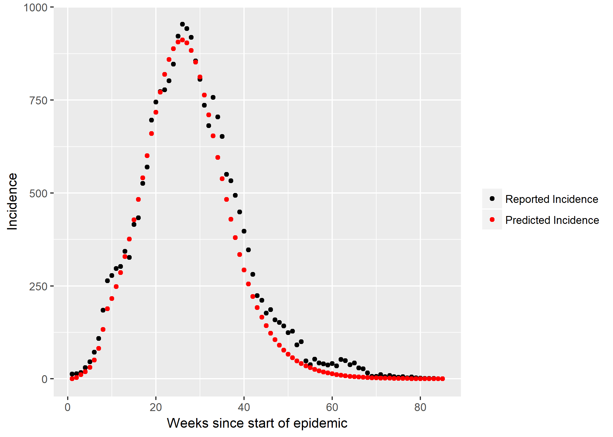

# Fictional virus outbreak forecasting

This is a compartmental model fit by maximum likelihood to a fictional virus outbreak scenario in Chioggia, Italy. This was conducted as part of the coursework for the Outbreaks module of the MSc in Epidemiology at Imperial College London.

